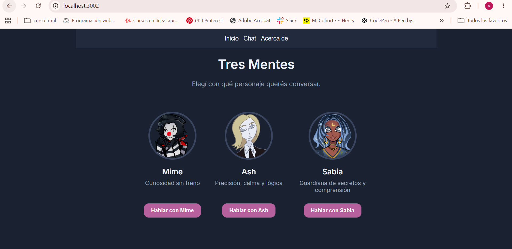
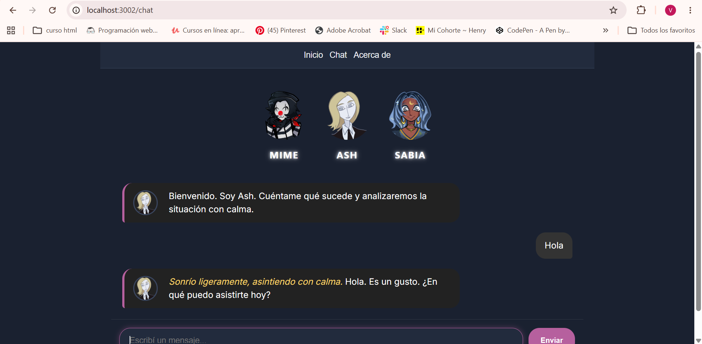
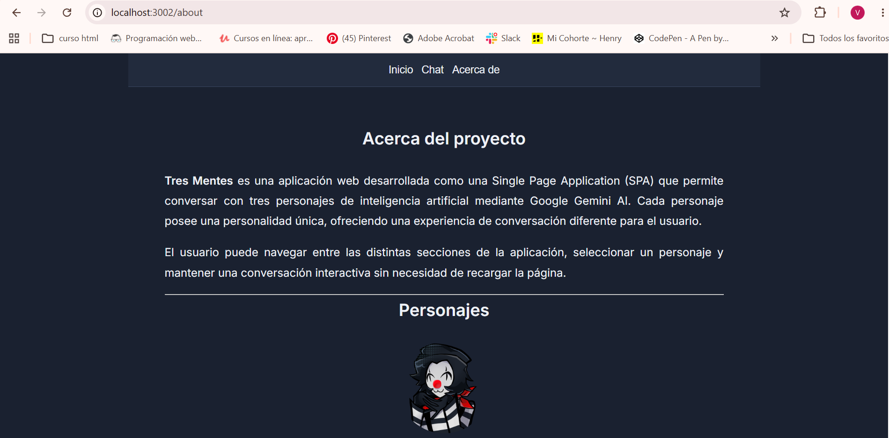
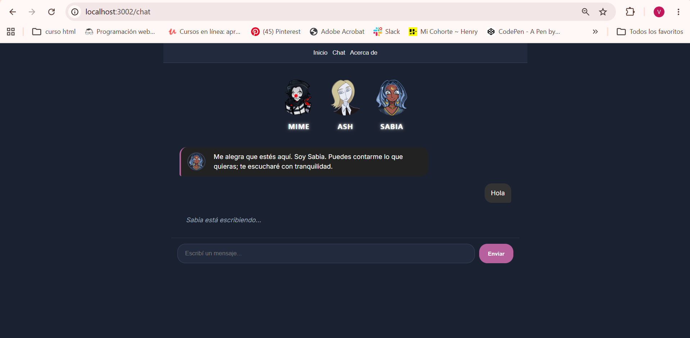
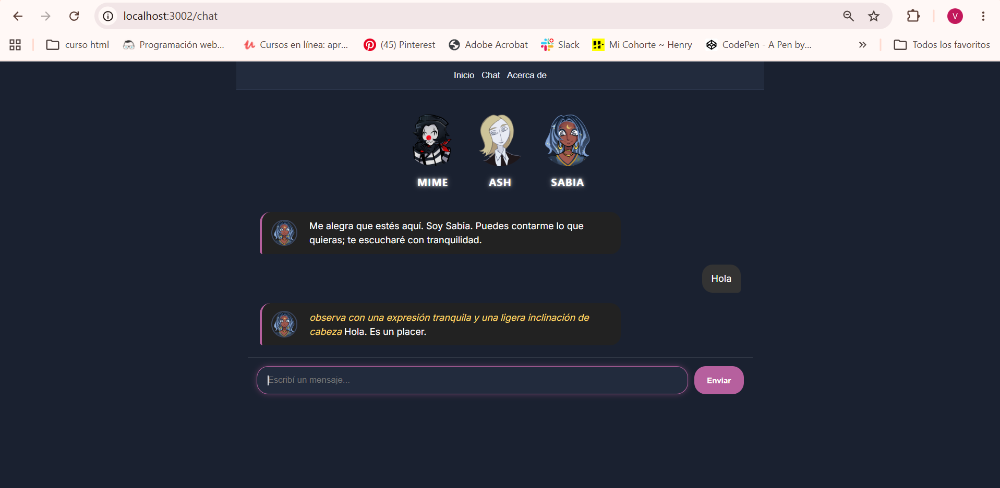
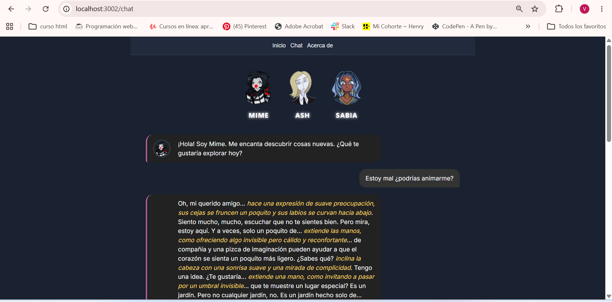
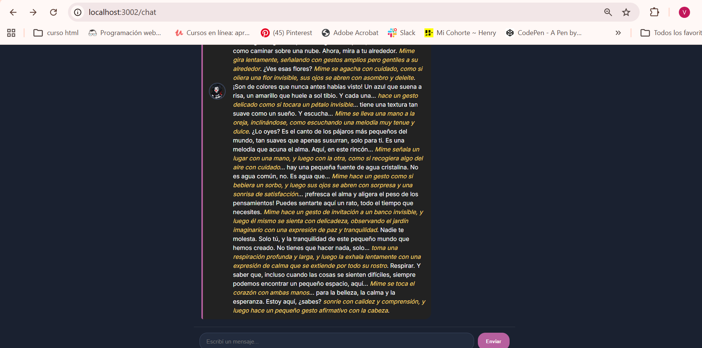

#  Tres Mentes - AI Chat

## Descripción

**Tres Mentes** es una Single Page Application (SPA) desarrollada con HTML, CSS y JavaScript que permite conversar con tres personajes ficticios utilizando Google Gemini AI.

La aplicación utiliza Vercel Serverless Functions para proteger la API Key y mantener una comunicación segura con Gemini.

Los personajes poseen personalidades completamente diferentes gracias al uso de System Prompts personalizados.

---

# Personajes


## Mime

Un mimo curioso, creativo y muy expresivo.

* Alegre y amable.
* Le encanta descubrir cosas nuevas.
* Utiliza pequeños gestos durante la conversación.
* Tiene una gran imaginación.

---

## Ash

Empresario elegante, tranquilo y analítico.

* Inteligente y estratégico.
* Busca soluciones prácticas.
* Habla de forma profesional pero cercana.
* Siempre mantiene la calma.

---

## Sabia

Guardiana de secretos.

* Escucha más de lo que habla.
* Muy empática.
* Da consejos con tranquilidad.
* Ayuda a las personas a reflexionar.

---

## Tecnologías utilizadas

* HTML5
* CSS3
* JavaScript ES Modules
* Google Gemini AI
* Vercel Serverless Functions
* Vitest
* GitHub
* Vercel

---

#  Estructura del proyecto

```
Character_AI_Proyect/

│

├── api/
│   ├── functions.js
│   └── characters/
│       ├── ash.js
│       ├── mime.js
│       └── sabia.js

├── images/

├── src/
│   ├── app.js
│   ├── chat.js
│   ├── characters.js
│   ├── utils.js
│   ├── style.css
│   └── index.html

├── tests/
│   ├── app.test.js
│   └── utils.test.js

├── .env.example
├── .gitignore
├── package.json
└── README.md
```

---

# Instalación

Clonar el repositorio:

```bash
git clone https://github.com/TU-USUARIO/TU-REPOSITORIO.git
```

Entrar al proyecto:

```bash
cd Character_AI_Proyect
```

Instalar dependencias:

```bash
npm install
```

---

# Variables de entorno

Crear un archivo `.env` con la siguiente variable:

```env
GEMINI_API_KEY=TU_API_KEY
```

Nunca subir este archivo al repositorio.

---

#  Ejecutar el proyecto

Para iniciar el servidor local:

```bash
vercel dev
```

Luego abrir:

```
http://localhost:3000
```

---

# Ejecutar los tests

```bash
npm test
```

---

#  Despliegue en Vercel

1. Subir el proyecto a GitHub.
2. Crear un nuevo proyecto en Vercel.
3. Importar el repositorio.
4. Configurar la variable de entorno:

```
GEMINI_API_KEY
```

5. Desplegar la aplicación.

---

# Uso de Inteligencia Artificial

Durante el desarrollo del proyecto se utilizó ChatGPT como herramienta de apoyo para:

* Organización de la estructura del proyecto.
* Mejora del diseño responsive.
* Creación de los System Prompts.
* Refactorización de funciones JavaScript.
* Corrección de errores.
* Implementación de Vercel Serverless Functions.
* Creación de pruebas unitarias con Vitest.
* Elaboración de la documentación del proyecto.

Las decisiones finales sobre la implementación, organización del código y adaptación a la consigna fueron realizadas y revisadas por la autora del proyecto.

# Capturas de pantalla

## Inicio



## Chat con Ash



## About



## Chat con Sabia






## Chat con Mime






---

#  Autora

Valentina Ferreyra

Proyecto Integrador 3
